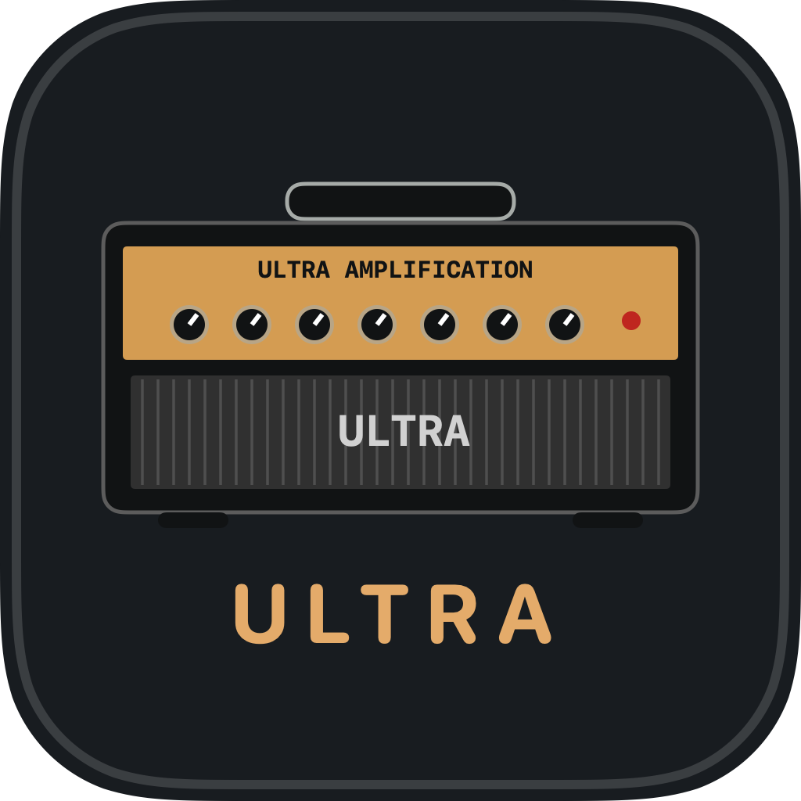
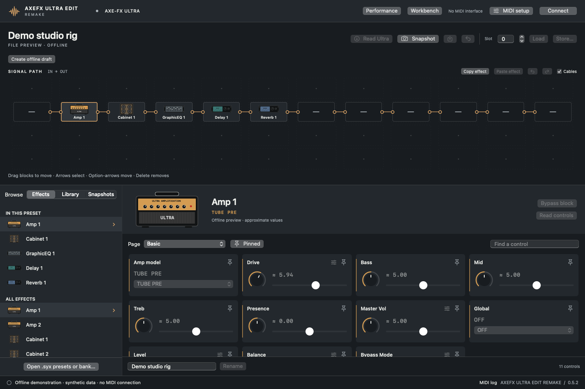
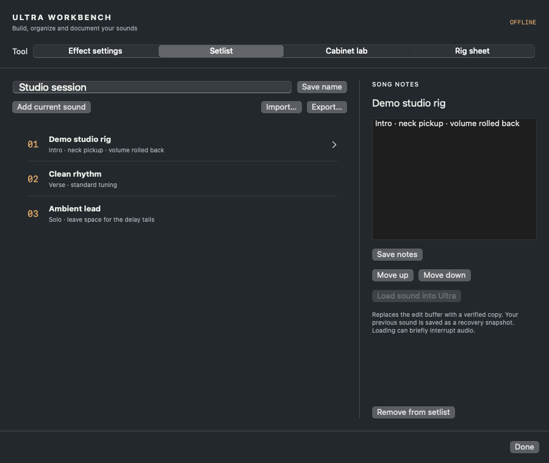

<div align="center">



# AxeFX Ultra Edit Remake

### Your Axe-Fx Ultra. A native Mac workspace.

Edit sounds, shape signal paths, and organize a personal library on Apple Silicon.


**[Website](https://iamknow0ne.github.io/axefx-ultra-edit-remake/)** · **[Download 0.5.2](https://github.com/iamknow0ne/axefx-ultra-edit-remake/releases/tag/v0.5.2)** · **[Getting started](docs/INSTALLATION.md)** · **[User guide](docs/USER-GUIDE.md)** · **[Feature status](docs/FEATURES.md)**

</div>



*The production interface, rendered with synthetic offline demonstration data. No factory or personal presets are distributed.*

AxeFX Ultra Edit Remake is an independent replacement for the legacy Axe-Edit application, built specifically for the **first-generation Axe-Fx Ultra**. It runs natively on Apple Silicon, with illustrated effect blocks, direct MIDI editing, and a local workspace for sounds and experiments.

**Development beta:** the download is ad-hoc signed, **not Apple-notarized**. Read the [first-launch instructions](docs/INSTALLATION.md#first-launch). Real-device testing used an Ultra on firmware 11.00 through a Clarett 8Pre, on macOS 27.0. The macOS 13+ deployment target does not mean every OS, firmware, or interface combination has been tested. Full legacy feature parity is not yet complete.

## Make the hardware feel at home

| In the editor | What you can do |
| :--- | :--- |
| **Responsive controls** | Stream slider changes during a gesture, prioritize them over background reads, and verify the final value. One gesture creates one Undo step; live Redo and numeric entry are included. |
| **Interactive signal grid** | Move blocks, swap occupied cells, drag connections, reroute cables, and undo routing edits within the Ultra's 4 × 12 topology. |
| **Illustrated effects** | Browse original vector artwork, page controls, search parameters, pin favorites, and open modifier controls. |
| **All 384 slots** | Double-click to recall a slot, step through filtered results with Previous/Next, browse banks A/B/C; search by slot number; read individual sounds or a whole bank; copy sounds into the Mac library, or back up complete banks as `.syx`. |
| **A personal library** | Import `.syx` presets or banks, search names/effects, mark favorites, preview, load into the edit buffer, and export. |
| **Recovery and comparison** | Capture named snapshots, inspect exact changes, back up the current sound, and restore with full-preset readback. |

The catalog contains **36 effect families, 69 instances, and 922 control definitions**. These are metadata counts, not a claim that every control has been verified on hardware. Noise Gate, Output, and Controllers now support verified whole-preset edits; these apply on release rather than streaming.

## New in 0.5

- **Numbered bank workspace:** reorder, copy, swap and rename sounds across slots 0–383, with local Undo/Redo and complete bank export.
- **Live Redo and numeric entry:** recover parameter/model changes; refuse history that would overwrite a newer front-panel edit.
- **Modifier workspace:** scan assignments, save reusable shapes and apply them source-first with individual readback.
- **Faster navigation:** keyboard grid selection/movement/removal, effect clipboard, file drop, Finder opening, recent files and library folders.
- **Performance tools:** block bypass, incoming tempo display, tap tempo and tuner controls with configurable MIDI assignments.
- **Preset globals:** Noise Gate, Output and Controllers through complete verified transfers.


[What's verified in 0.5 →](docs/VERIFICATION-0.5.0.md)

## More room to experiment

Seven modern workspace tools extend the editing workflow:

1. **Autosaved offline drafts** — edit existing parameters, names, and routing with 100-step Undo/Redo and recovery after restart.
2. **Reusable effect settings** — save a block's parameters and paste into a compatible instance, retaining destination routing and modifiers.
3. **Portable setlists** — order songs, add notes, and carry a preset copy for each entry in one `.ultraset` file.
4. **Cabinet preparation and blending** — trim, resample, normalize, blend two IRs, invert polarity, and adjust sample delay.
5. **Local NAM linear-response extraction** — run NAM locally and estimate filtering around silence, with a two-level sensitivity report.
6. **Local audio audition** — compare a short WAV dry and through the prepared cabinet, then export the processed audio.
7. **Readable rig sheets** — export Markdown with routing, control values, and a preset fingerprint for session notes.

| Cabinet Lab | Portable setlists |
| :---: | :---: |
|  |  |
| Prepare and audition 48 kHz / 1,024-sample impulses. | Keep sounds and performance notes together. |

**An IR cannot faithfully reproduce a NAM model's distortion, compression, or playing dynamics.** The Ultra does not run NAM models. Cabinet Lab exports WAV and Gen-1 user-cab `.syx`. Direct cab transfer is experimental: coefficient readback and hardware audio validation remain open. [Cabinet Lab guide →](docs/CABINET-LAB.md)

## Get connected

1. Download the **arm64 DMG** from the [release page](https://github.com/iamknow0ne/axefx-ultra-edit-remake/releases/tag/v0.5.2), open it, and drag **AxeFX Ultra Edit Remake** to **Applications**.
2. Connect both MIDI cables: **interface OUT → Ultra IN**, and **Ultra OUT → interface IN**.
3. Open **MIDI setup**, select the interface's input/output and matching MIDI channel, then choose **Connect**.
4. Use **Back up** before experimenting. Choose a block to edit; open **Library → Ultra → Read all 384** to fetch stored sounds.

An incoming tempo light confirms only one direction of MIDI. The editor needs both cables. [Installation and connection guide →](docs/INSTALLATION.md)

Most edits affect the Ultra's **temporary edit buffer**. **Store…** overwrites a numbered hardware slot. Its backup/write/readback path was **validated on the explicitly designated slot 300**, followed by exact restoration of the destination and active sound. Keep separate backups and read the [preset guide](docs/USER-GUIDE.md#loading-saving-and-backing-up).

Previews, drafts, settings, setlists, and snapshots live on your Mac. No accounts or cloud services are required. Updates are installed manually.

## Documentation

| Guide | Contents |
| :--- | :--- |
| [Install & connect](docs/INSTALLATION.md) | Requirements, first launch, wiring, updates and removal |
| [Complete user guide](docs/USER-GUIDE.md) | Every editor workflow, routing, library, snapshots, drafts, setlists and shortcuts |
| [Effect & control reference](docs/CONTROL-REFERENCE.md) | All 36 families and 922 catalog definitions, pages, ranges and model choices |
| [Cabinet Lab](docs/CABINET-LAB.md) | IR processing, NAM limits, blending, audition and export |
| [Feature status](docs/FEATURES.md) | Available features, evidence boundaries and missing capabilities |
| [Troubleshooting](docs/TROUBLESHOOTING.md) | Connection, latency, missing slots, recovery and diagnostics |
| [Build & contribute](CONTRIBUTING.md) | Source build, synthetic tests, screenshots and packaging |
| [Architecture](docs/ARCHITECTURE.md) | MIDI scheduling, preset preservation and source layout |
| [Release process](docs/RELEASING.md) | Packaging, checksums, signing and publication |
| [Changelog](CHANGELOG.md) | Version history |

## Built for the Ultra

Standard, II, III and FM devices are outside scope. Firmware updating is deliberately excluded. Bulk bank writes, effect initialization, MIDI learn/merge, system-wide I/O settings, and complete legacy file interchange remain unavailable. Tuner/tempo controls and cab transfer are implemented but still need the separate hardware checks described in the feature audit. The [legacy parity audit](docs/PARITY-1.0.191.md) records the remaining gaps.

Build with Swift 5.9+, the macOS SDK, CMake, and Python 3:

```sh
./scripts/build.sh
./scripts/test.sh
./scripts/test-editor.sh
python3 scripts/test-nam.py
./scripts/package-dmg.sh
```

No legacy installer, extracted executable, personal preset dump, or private capture is needed. See [CONTRIBUTING.md](CONTRIBUTING.md) for prerequisites.

## Credits & licensing

Independent software; not affiliated with or endorsed by Fractal Audio Systems. Axe-Fx and Axe-Edit names identify compatible devices and formats. Illustrations are original generic device artwork.

The offline helper uses [NeuralAmpModelerCore](https://github.com/sdatkinson/NeuralAmpModelerCore), [Eigen](https://eigen.tuxfamily.org/), and [nlohmann/json](https://github.com/nlohmann/json). Their licenses and source are included; see [third-party notices](THIRD_PARTY_NOTICES.md).

No open-source license has yet been selected for the original application code. Dependencies retain their own licenses.
