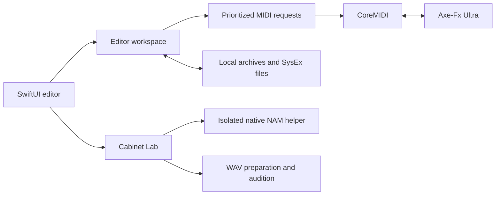

# Architecture

[Documentation index](README.md) · [Build](../CONTRIBUTING.md)

## Source layout

| Area | Responsibility |
| --- | --- |
| `Sources/UltraCore` | Catalog, SysEx codec, transport, request queue, live-edit state machine, grid mutation, archives and IR processing |
| `Sources/UltraEdit` | Native views, workspace state, device/local libraries, grid gestures and Cabinet Lab |
| `Sources/UltraProbe` | Developer diagnostics, virtual simulator and opt-in hardware verification modes |
| `tools/nam-ir.cpp` | Local two-level NAM linear-response extraction |
| `Vendor/` | Pinned NAM core and dependencies, with source/license notices |
| `Resources/` | Recovered interoperability catalog, original icon, license notices |
| `Tests/` | Software/integration tests and generated synthetic fixtures |
| `scripts/` | Build, test, screenshot, documentation and DMG tools |

## Preset preservation

Gen-1 Ultra messages use model byte `0x01`. Modern messages begin `F0 00 01 74 01`; the pre-10.02 header uses a configured legacy ID. Single-preset transfer wraps a 1,024-byte payload in nibble encoding with an XOR checksum, producing 2,060 bytes. Bank import checks its aggregate checksum and assigns absolute A/B/C addresses.

The payload parser exposes name, grid and known parameter records while retaining all original bytes. Editing mutates only the intended range. Modifiers and unknown trailing data must survive ordinary parameter and routing operations. SHA-256 fingerprints compare payload identity, not the storage address wrapper.

Stored reads cover 0–383. On the tested Ultra, bank-C replies can echo a truncated address; `DevicePresets.swift` normalizes this only against the explicitly requested slot and rejects unrelated replies.

## Scheduling and live changes

`RequestQueue` correlates replies with the active request, prioritizes foreground writes over background reads, cancels deferred work, and does not automatically retry writes after timeout. `LiveParameterEdit` sends the newest pending target, avoiding hundreds of obsolete pointer updates. Gesture completion obtains the final value and preserves one Undo operation.

Full-preset transfers use native `MIDISendSysex`. An acknowledgement is followed by an **800 ms settling interval**, then a separate full-preset readback. Earlier physical trials showed that an ACK alone was insufficient. Routing also re-reads fresh state before mutation and checks stale history to avoid overwriting later front-panel edits.

Model-selector GETs are excluded because firmware 11.00 queries can reinitialize amp parameters. Unvalidated global control IDs 139–141 remain preview-only. These are behavior-based restrictions, not missing metadata.

## Local workspace and processing

Atomic JSON archives store library, snapshots, draft, effect settings and setlist in Application Support. Corrupt archives surface errors instead of silent replacement. Setlist imports retain a before-import copy. Recovery snapshots precede live whole-preset replacement operations.

Cabinet Lab launches the bundled C++ helper as a separate process with a timeout. NAM files are data, not executed source. The helper performs actual model inference at two small signal levels and exports response data; Swift handles IR preparation, plotting, blending and audio convolution. This processing is separate from the live MIDI control path. No cloud transport, accounts, telemetry, firmware-flashing service or self-updater is included.

## Evidence boundaries

The simulator and synthetic fixtures validate software behavior, not physical timing or audio quality. Hardware reports cover one Ultra, one firmware and one interface. Persistent Store, user-cab upload, every control/model, every supported macOS version and complete legacy parity remain separate acceptance gates.
