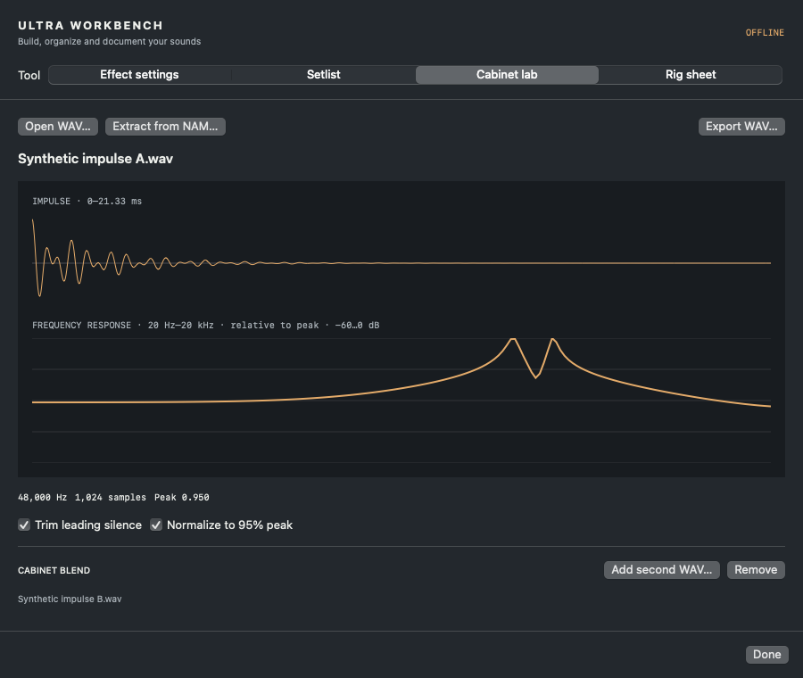

# Cabinet Lab

[Documentation index](README.md) · [User guide](USER-GUIDE.md)

Open **Workbench → Cabinet lab**. This is a local file-processing tool: it does not send cabinets to the Ultra or capture live audio.

## Prepare a WAV impulse

1. Choose **Open WAV…** and select a PCM or floating-point WAV, at most 32 MB.
2. Set **Trim leading silence** and **Normalize to 95% peak** as needed.
3. Inspect the impulse and relative frequency-response plots.
4. Choose **Export WAV…**.

Stereo input uses the **left channel**, not a stereo blend. Preparation resamples to **48,000 Hz**, trims when enabled, fits **1,024 samples (21.33 ms)** and fades the end. Short responses are padded. Longer tails are truncated: a long reverb IR is not preserved. Export is mono 32-bit float WAV. Normalization sets peak to 0.95, not a target perceived loudness.

The frequency plot spans 20 Hz–20 kHz and is relative to its peak, displayed from −60 to 0 dB. It is not a calibrated absolute-level measurement. A near-silent/cancelling result is rejected rather than normalized into noise.

## Blend two impulses

Use **Add second WAV…**. Both inputs receive the same preparation. Adjust **A / B** mix: 0% B uses A, 100% B uses B. **Invert B polarity** flips its sign. **B delay** shifts B by 0–256 samples (up to approximately 5.33 ms at 48 kHz). Delay can trim the tail to remain within 1,024 samples.

Equal-and-opposite impulses can cancel. If the app reports silence, change mix, polarity or delay. **Remove** returns to one input. Mix changes rebuild on release; the waveform and frequency plot show the final prepared blend.

## Extract a response from NAM

Choose **Extract from NAM…** and select a `.nam` file. The bundled native helper runs the model locally, probes near silence at two levels and estimates a linear impulse. It is then prepared using the same 48 kHz / 1,024-sample path. Use **Cancel** or **Cancel NAM extraction** in the Workbench footer to stop; extraction has a 90-second timeout.

**This is a linear approximation, not NAM-to-Axe-Fx amp conversion.** An IR cannot reproduce nonlinear distortion, compression, dynamics, or the full level-dependent behavior of a neural amp. The Ultra does not execute the NAM network. Even a low sensitivity percentage does not prove the result sounds like the original capture at playing levels.

The percentage reports how much the response changes between the two probe levels. It is **not a tone-match score**. Linear, WaveNet and LSTM synthetic models are tested with real inference; support for every NAM architecture/version is not guaranteed. An unsupported or malformed file produces an error. Models stay on this Mac; no upload or cloud conversion occurs.

No NAM captures are included. Use models you are entitled to process. The repository's synthetic models exist only for software tests.

## Audition and export audio

1. Prepare a non-silent IR.
2. Choose **Load audition WAV…** and select a non-silent **48 kHz WAV**, up to **15 seconds** and **8 MB**.
3. Use **Dry**, **Through cab**, and **Stop** to compare on the Mac's current output.
4. **Export audio…** writes the convolved WAV.

Use an amp recording **without a cabinet** for a meaningful cabinet comparison. A raw guitar DI is not turned into an amp sound here. NAM distortion is not rendered. Playback uses 35% player volume; the convolution path applies fixed attenuation when necessary to prevent clipping, without upward loudness matching. Expect level differences during A/B listening.

Changing the impulse/blend invalidates and rebuilds the audition result. Silence/cancellation disables it. Closing the tool stops playback. There is no microphone, reamp, realtime audio-plugin, or automatic hardware cab-audition workflow.

## Put the result on the Ultra

This release stops at **WAV export**. Direct user-cab SysEx encoding/upload, gain scaling and hardware readback have not been implemented and validated. A WAV export alone is not proof of a loaded hardware cabinet. Keep your source IR/model and follow a separately supported, verified cabinet-transfer workflow if available for your unit.
