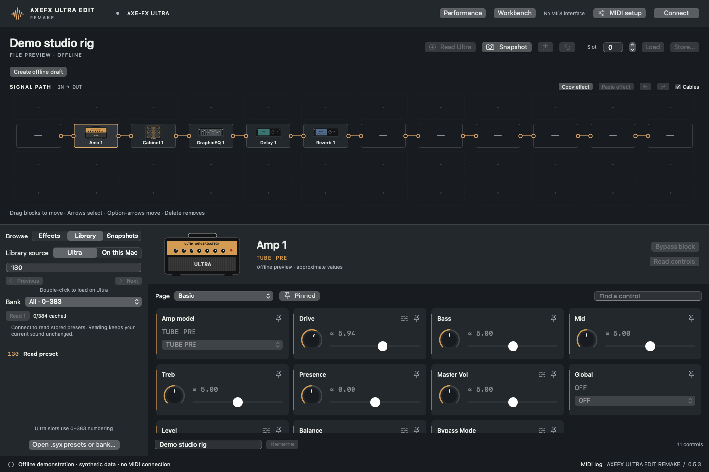

# AxeFX Ultra Edit Remake user guide

[Documentation index](README.md) · [Connect](INSTALLATION.md) · [Troubleshooting](TROUBLESHOOTING.md)

## Contents

- [Workspace](#workspace) and [effect editing](#editing-an-effect)
- [Interactive grid](#interactive-grid)
- [Loading, saving and backing up](#loading-saving-and-backing-up)
- [Preset libraries](#preset-libraries)
- [Snapshots](#snapshots-and-comparison) and [offline drafts](#offline-drafts)
- [Effect settings](#reusable-effect-settings) and [setlists](#portable-setlists)
- [Cabinet Lab](#cabinet-lab) and [rig sheets](#rig-sheets)
- [MIDI diagnostics](#midi-setup-and-diagnostics)
- [Shortcuts](#shortcuts-and-gestures) and [local data](#local-data-and-recovery)

## Workspace

The top bar contains connection status, **MIDI setup** and **Workbench**. Below are preset actions, the 4 × 12 signal grid, then the sidebar and effect inspector. The bottom bar reports operations and opens the MIDI log.

Check the mode below the preset name:

| Mode / location | What changes |
| --- | --- |
| **Live edit buffer** | Edits affect the currently playing sound, without automatically storing a numbered hardware slot. |
| **File preview / offline** | Inspect a local or cached preset without changing the Ultra. Load it to audition, or create a draft to edit locally. |
| **Offline draft** | Supported edits autosave on this Mac; no MIDI edits are sent. |
| **Stored slot** | A numbered hardware location, changed by explicit Store or another hardware application. |
| **Library, snapshots, setlist** | Independent local copies; later hardware changes do not update them. |

The **Slot** number is a Load/Store destination, not a reliable current-program display. **EDITED** does not mean a hardware slot has been saved.

## Editing an effect

1. Connect and read a sound, or preview an imported preset.
2. Select a grid block or **Effects → In this preset** entry.
3. Select a parameter page or **All**. Search matches control names/internal keys. Pin useful controls and enable the pinned filter to focus the inspector.
4. Adjust the available sliders, menus or switches. Some operations disable while transfers run.

Artwork identifies the effect family; it is original generic illustration. **All effects** also lists catalog instances absent from the current preset. Selecting one does not insert it.

The [complete control reference](CONTROL-REFERENCE.md) lists all families, instances, parameter pages, display ranges, raw defaults, modifier IDs and model choices. It is a catalog reference, not an all-controls validation claim.

### Displayed values and responsiveness

Live responses can supply the Ultra's own displayed units. Catalog estimates may show **≈**. An unread/unavailable value is not zero. The 922 catalog definitions are not all hardware-validated.

Sliders send during movement. The newest pending value replaces obsolete intermediate positions, live changes overtake queued background reads, and release triggers final readback. One gesture makes one Undo entry. DIN MIDI and the Ultra impose latency; this is not sample-accurate automation. Whole-preset transfers are slower than single-parameter edits.

Changing an amp/effect **model** can reset other block settings. Model Undo uses a whole-preset recovery copy. On firmware 11.00, querying a model selector can itself reset amp values, so the app reads selectors from preset dumps rather than issuing those live queries.

### Modifiers

Use the modifier action on an eligible control to open its modifier panel. Change the displayed source/response fields, then close the panel to return. Some values remain raw numbers. Source and damping received physical readback testing; complete source naming and all response shapes have not been validated. Offline drafts cannot edit modifiers.

### Undo and protected controls

The main **Undo/Redo** reverses supported live parameter, model and routing changes, with fresh-state protection against newer front-panel edits. Loading/refreshing can clear temporary history. Use snapshots to keep complete sounds across restarts.

Noise Gate, Output and Controllers now use verified whole-preset edits, applied on release. Click a value for numeric entry; use **Bypass block** for a supported block, or **Performance** for tempo/tuner controls. See the [new workspaces guide](WORKSPACES-0.5.md) for their operation and hardware evidence limits.

For assignment scanning and reusable modifier shapes, see [Modifier workspace](WORKSPACES-0.5.md#modifiers).

## Interactive grid

Blocks move between cells in the Ultra's fixed **four-row, twelve-column** layout. Cables connect adjacent columns from left to right. Shunts carry a route through unused columns. Free movement means valid grid positions, not arbitrary pixel coordinates or unrestricted graph topology.

| Action | Gesture / control | Behavior |
| --- | --- | --- |
| Select | Click block body | Opens its inspector. |
| Move | Drag to an empty cell | Same-column moves carry incoming/outgoing cables. |
| Swap | Drop onto an occupied cell | Exchanges effects; position wiring stays in place. |
| Cross-column move | Drag to a valid cell | Rejects incompatible topology. |
| Move and detach | **Option-drag** | Explicitly detaches incompatible attached links. |
| Connect | Drag output socket → input, or reverse | Adds a valid adjacent-column connection. |
| Select cable | Click cable | Enables disconnection. |
| Disconnect | **Delete/Backspace** or **Disconnect** | Removes selected link. |
| Reroute | Drag cable to another valid destination | Replaces that connection. |
| Cancel | **Escape** during drag | Abandons the gesture. |
| Keyboard selection/move | Arrows / **Option-arrows**, with grid focused | Select a cell / move within valid topology. |
| Remove block | **Delete/Backspace**, with block selected | Live readback and Undo; draft changes stay local. |
| Effect clipboard | **Copy effect / Paste effect** | Compatible parameter settings; destination routing/modifiers retained. |

Right-click a cell for context-sensitive placement, shunt, removal, movement and previous-column input-connection actions. You cannot duplicate an effect instance by dragging. Empty cells and invalid directions cannot be cable endpoints.

New move/swap/connect/disconnect/reroute operations keep **50 live Undo steps**, with Redo. Each transaction reads fresh state, captures recovery, uploads the change, waits for hardware settling, then compares the complete preset readback. This preserves unrelated front-panel changes made before the operation.

If the grid changed externally, or Undo would overwrite a newer external edit, the app rejects the operation. Refresh and review before trying again. An acknowledgement alone is not treated as successful readback.

Complete routing transactions took about three seconds on the tested connection and can briefly interrupt audio. Keyboard removal now creates a verified history entry. Older context-menu placement/replacement actions reset grid history. Capture a snapshot before using them.

## Loading, saving and backing up

### Read Ultra

**Read Ultra** refreshes the edit buffer from the Ultra and clears temporary history. It does not permanently save edits.

### Rename

Use **Rename** and enter up to **20 printable ASCII characters**. Accents and emoji do not fit the hardware name format. Live rename changes the edit buffer; draft rename changes the local draft. Store separately for a permanent slot change.

### Back up

Choose **Back up** / **Command-S** to save a fresh `.syx` copy of the current sound. A single preset is a checksummed 2,060-byte SysEx message. Keep this for exact recovery, including opaque data the UI cannot decode. Command-S is backup, **not Store**.

### Load

For hardware recall, set Slot to **0–383**, choose **Load**, and review the confirmation about replacing unsaved buffer changes. Recall sends bank-select/program-change on the configured channel.

**On this Mac** library and setlist **Load** send the embedded preset copy into the temporary edit buffer, with a recovery snapshot of the prior sound and verified readback. It does not overwrite a numbered slot. Audio can pause during transfer.

### Store…

**Store… overwrites the selected hardware slot.** Check the Slot field and confirmation carefully. The implementation backs up the destination before writing and reads it afterward; backup failure blocks the write.

Persistent Store was physically validated using the owner-designated **slot 300**. The test wrote a temporary renamed preset, compared all 1,024 payload bytes, then restored both the original destination and original edit buffer exactly. This validates the tested unit/firmware/interface, not every combination. Keep independent `.syx` backups. Full-bank hardware writes are not included.

## Preset libraries

Choose **Library** in the sidebar, then **Ultra** or **On this Mac**.

**Previous / Next** loads the neighboring preset in the visible results. Ultra navigation follows the bank and search filter; Mac navigation follows name order, search, folder and favorites. The selected row is highlighted and scrolls into view. Navigation stops at either end. With no selected result, Next starts at the first result and Previous at the last. Clear a single-slot search to browse neighboring numbers.

Each activation saves the actual current hardware sound in **Snapshots** before switching. These actions do not show a confirmation each time and do not store or overwrite numbered slots. Controls disable while loading, while editing an offline draft, and when MIDI is disconnected. Hardware switches read and verify the sound; they are not gapless performance changes.

The Ultra can upgrade older preset records and initialize missing globals when recalling a stored slot. The app validates the checksummed readback's name, routing and effect instances, then displays the actual device parameters. A stored-slot recall is therefore not a byte-for-byte comparison with an older stored file. Mac-library uploads still use exact payload comparison. MIDI program mappings can redirect recalls; presets with identical names and routing cannot be distinguished by this identity check.

### Ultra: all 384 slots

| Bank | Zero-based addresses |
| --- | --- |
| A | 0–127 |
| B | 128–255 |
| C | 256–383 |

All addresses remain visible even when unread or unnamed. Select a bank, **Read all 384**, the filtered **Read** button, or an individual unread row. **Stop** cancels a scan; already read entries remain cached. A full scan takes several minutes. Reads do not change the playing sound.

Typing **130**, for example, jumps directly to that address even if another bank is selected. Name searches match only names already fetched. An empty name search does not prove a slot is empty. If your front panel uses 1-based numbers, subtract one for this editor.

Once a row is read:

- **Preview** displays the cached preset locally.
- **Load** or **double-click the preset name** recalls the actual numbered Ultra slot, with a recovery snapshot and readback. Unread slots are read automatically.
- **Copy to Mac library** retains a persistent local copy.

The device cache lasts for the current connection and clears on disconnect. Duplicate names or identical sounds in different device slots remain separate rows.

*Synthetic offline demonstration; no device read is implied by this image.*

### On this Mac: local collection

Use **Open .syx presets or bank…** / **Command-O** to import single presets or supported A/B/C bank files. Checksums are validated. Identical payloads are deduplicated locally, and original source files are untouched.

Single-click an entry title to preview it; **double-click** to load it onto the connected Ultra. Search matches names, source and effect names. Stars and **Favorites** focus the collection. **Load** auditions a copy on the connected Ultra; **Export** writes a single `.syx`.

Use **Workbench → Banks** for numbered local reorder/copy/swap/rename and complete bank backup/export. **On this Mac** remains a deduplicated collection with logical folders. File drop, Finder opening, recent files and top-level folder import are supported. See [Banks and files](WORKSPACES-0.5.md).

## Snapshots and comparison

1. Open **Snapshots**, enter a name, and select **Capture current sound**. Live capture fetches a fresh preset; an offline preview can also be captured.
2. **Compare** displays differences from the current sound.
3. **Restore** sends the snapshot into the live edit buffer, preserving the previous sound as a recovery snapshot and verifying readback.
4. The export icon writes a standalone `.syx` copy.

Comparison identifies name, grid, known parameters and opaque-byte differences. Opaque changes are real but are not automatically interpreted as named modifier settings. Snapshots persist across restarts. Automatic recovery snapshots share this archive; keep external backups too.

## Offline drafts

Choose **Create offline draft** from a current preset or preview. The mode bar confirms that changes remain on the Mac. Edit ordinary non-global parameters, names and routing of existing blocks.

Draft **Undo/Redo** keeps up to **100 steps**. Changes autosave; **Resume saved draft** restores the saved work after restart. There is one current draft, not a multi-document manager.

**Export draft…** writes `.syx`. **Finish draft** returns to the connected device's state, or clears the offline editing view. To audition an exported draft, finish draft mode, import the file into the local library, and Load it.

Drafts cannot create new effect records/instances, initialize models, change model selectors through ordinary controls, or edit modifiers. A compatible complete effect setting can replace an existing parameter record. Displayed units may be estimates.

## Reusable effect settings

Select a block, open **Workbench → Effect settings**, name it, and choose **Save selected effect**. Entries retain family, parameter bytes and source name.

Select a destination block in the editor and use **Paste to selected block**. Both effect family and record length must match. Destination routing and modifiers remain intact. Live paste takes recovery and verifies the whole preset; draft paste stays local. The trash button deletes a setting from this local collection.

Global settings and original Axe-Edit effect-file interchange are not supported.

## Portable setlists

Open **Workbench → Setlist**. Enter a title and **Save name**. **Add current sound** embeds a full preset copy; the initial entry title comes from its preset. Repeated sounds can be separate entries.

Select an entry, edit notes, then **Save notes**. **Move up / Move down** reorders it. **Remove from setlist** deletes only the entry. **Load sound into Ultra** replaces the edit buffer with the embedded copy, with recovery/readback. It does not track later source changes, store a hardware slot, provide gapless switching or act as a footswitch controller.

**Export…** creates a `.ultraset` containing songs, notes and sounds. **Import…** validates the file, creates a local before-import backup, then replaces the active list. Maximum **512 entries**. This format is independent of legacy bank/setlist interchange.

## Cabinet Lab

**Workbench → Cabinet lab** prepares/blends WAV impulses, extracts a limited NAM linear response, auditions audio and exports results locally. The [Cabinet Lab guide](CABINET-LAB.md) explains every option and format limit.

## Rig sheets

Choose **Workbench → Rig sheet → Export rig sheet…** for Markdown containing the name, signal path, known control values, exact raw bytes and payload fingerprint. Live export reads a fresh preset.

Displayed units can be approximate. A report is not an importable preset or a replacement for `.syx` recovery. It does not preserve all modifier/internal data in readable form or implement legacy CSV interchange.

## MIDI setup and diagnostics

**MIDI setup** selects input/output, program channel and the older-firmware SysEx option. Disconnect to edit these settings; **Refresh ports** updates the endpoint list.

**MIDI log → Export…** saves recent traffic and operation messages. Timeouts/disconnections appear in the UI. Incoming tempo is not proof of bidirectional connectivity. Logs can contain preset names and data; review them before sharing.

No MIDI learn, merge/THRU router, loopback wizard, firmware updater or automatic external-controller synchronization is included.

## Shortcuts and gestures

| Shortcut | Action |
| --- | --- |
| Command-K | Connect/disconnect when enabled |
| Command-O | Open `.syx` presets/banks |
| Command-S | Back up; does not store a numbered slot |
| Command-Z | Undo available editing history |
| Shift-Command-Z | Available routing/draft Redo, not general live parameter Redo |
| Delete / Backspace | Disconnect selected cable when grid has focus |
| Escape | Cancel grid drag; dismiss supported dialogs |
| Option-drag | Explicitly detach incompatible links in a move |
| Right-click | Grid context actions |

Text fields retain standard macOS behavior. Use native menus/on-screen Undo and Redo when focus makes a shortcut ambiguous. Full grid keyboard navigation and an exhaustive VoiceOver audit remain incomplete.

## Local data and recovery

Data lives in **`~/Library/Application Support/Ultra Edit/`**: library and snapshots archives, current draft, effect settings, setlist, before-import backups, and a `Backups/` directory for the Store path. MIDI endpoint choices and pins also use macOS preferences under `tech.hostin.ultra-edit`.

Quit before copying the whole folder for workspace backup. Export important presets separately and retain off-machine copies. Imported originals are untouched; deleting a source file does not remove an imported copy.

A corrupt archive raises an error instead of silently replacing it with an empty file. Preserve it and recover from a known-good backup. After interrupted MIDI transfer, read actual hardware state and inspect recovery snapshots before writing again. The app requires no account/cloud service and has no telemetry transport or built-in updater.

### Background connection checks

The editor checks the connection every five seconds when idle. These health probes do not reload presets, disable buttons or show a pending-work spinner. Operations that transfer or verify a preset still temporarily lock conflicting controls. A missing health-check reply reports a lost connection.

### Saved Ultra library cache

Each successfully read slot is saved automatically on this Mac. You can stop a scan and keep its completed reads. On restart, the last cached library appears immediately, including names, search and offline previews. Disconnecting does not erase it. Read all 384 once; use **Refresh all 384** (or the filtered/bank Refresh button) when you want to update it. Individual live recalls and verified Store operations refresh that slot too.

The library shows its cached count and last cache time. Cache profiles are separated by MIDI input/output identity, channel and protocol. This is not a hardware serial number: if you attach another Ultra to the same connection or modify presets on the front panel, refresh the cache. Loading a slot always reads and checks the actual device; cached bytes are never uploaded by Ultra-slot recall. Complete bank backups also populate the cache.

The cache lives in `~/Library/Application Support/Ultra Edit/Device Cache/`, with atomic files per slot. An interrupted scan retains completed slots; an unreadable slot is skipped with a warning and can be replaced by Refresh. Cache errors do not prevent the app from reading the hardware.
