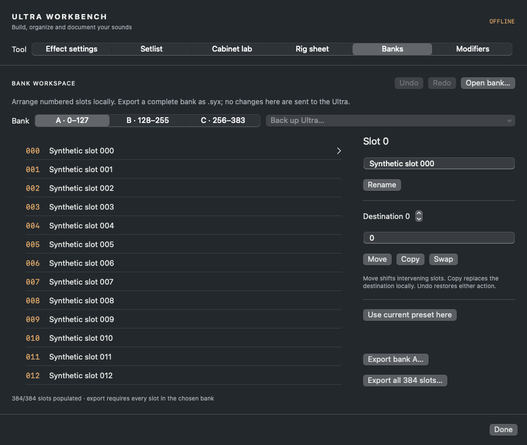
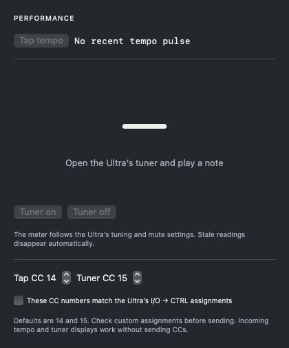

# Banks, performance and editing tools

[User guide](USER-GUIDE.md) · [Feature status](FEATURES.md)

## Numbered banks

Open **Workbench → Banks** or **File → Bank workspace**. These slots are a local arrangement, separate from both the Mac library collection and the Ultra's stored memory.

1. Choose **Open bank…** for a Gen-1 `.syx` bank, or **Back up Ultra…** for a fresh bank A, B, C or all 384 slots. Both MIDI cables must be connected. Each full bank takes about 90 seconds over DIN MIDI. The app waits one second after stored reads for the Ultra's transfer buffer to settle.
2. Select a numbered row. A covers 0–127, B 128–255 and C 256–383.
3. Rename the sound, or enter a destination and choose **Move**, **Copy** or **Swap**. Move shifts the intervening slots; Copy replaces the local destination; Swap exchanges the two slots, including an empty destination. Cross-bank destinations are supported.
4. **Undo/Redo** in this panel keep 30 local states. **Use current preset here** inserts a fresh current sound, or the current preview/draft.
5. **Export bank…** writes one complete bank; **Export all 384 slots…** writes three bank messages in one `.syx`. Export refuses missing slots, so an incomplete download cannot masquerade as a complete backup.

Bank edits send no hardware writes. This release does not bulk-send a bank. The bank workspace is held in memory: **export before quitting**. Its local history is separate from the editor's Undo menu. A new import or completed backup replaces the workspace, with Undo available. Stop cancels subsequent reads; a bank dump already in flight may finish before controls become available. Keep a separate unchanged backup before rearranging sounds.

## Numeric entry and live history

Click an editable parameter's displayed value. **Exact raw value** accepts whole numbers in the displayed range. **Estimated units** is available for numeric catalog mappings: values are converted to the Ultra's discrete raw scale. These units are estimates, not a calibrated conversion. The subsequent hardware response is authoritative. Invalid, non-finite and out-of-range input is rejected.

**Command-Z** and **Command-Shift-Z** undo and redo supported live parameter/model changes. One slider gesture creates one step. Before history restores a whole preset, the app reads the active sound; a newer front-panel change causes rejection rather than being overwritten. A later parameter change clears the routing-only buttons so they cannot discard that parameter change; use the main Undo history to step back in order. Explicit refresh/disconnect clears temporary history. Use snapshots for persistent history. Parameter adjustments stream during a gesture; history restoration and preset globals use slower complete transfers.

## Grid keyboard and clipboard

Click the grid to give it keyboard focus. Arrow keys select neighbouring cells. **Option-arrow** moves the selected block within the supported topology. **Delete/Backspace** disconnects a selected cable or removes the selected block. Text fields retain their normal editing keys. Existing pointer drag/socket/rerouting and context menus remain available.

**Copy effect** puts the selected block's parameter settings on the Mac clipboard. **Paste effect** applies them to a compatible family and record length. It preserves destination routing and modifier assignments, takes a recovery snapshot for live paste, and verifies the complete result. These are app-specific settings, not legacy Axe-Edit setting-file interchange. They do not copy an entire grid instance or operate on preset globals.

## Files and library folders

Use **Open SysEx…**, drop `.syx` files on the editor, or open a registered `.syx` document in Finder. Import goes into **On this Mac** without loading hardware. Duplicate sounds are skipped. Invalid file batches do not partially import. The app registers as an alternate handler; use Finder's **Open With → Ultra Edit** if another app is the default.

**File → Recent files** remembers the last 12 paths; moved files need to be opened again. **Import folder…** imports the top level of a folder containing 1–512 `.syx` files. The local library folder menu filters logical groups; create a folder there, then use a preset's context menu to assign it. These groups do not move or delete the original files. Device slots retain their numbers even when names/sounds repeat.

## Modifiers

Open **Workbench → Modifiers → Read current preset**. The app queries each eligible source on effects present in the current sound. Filter to assigned controls or show all, then **Edit** a row. Stop halts subsequent queries. The overview is a snapshot; read it again after external changes.

In an individual modifier panel, choose the source before editing shape values. Enter a preset name and **Save** to keep all nine fields locally. **Apply modifier preset** backs up the current sound, writes Source first, then Start/Mid/End/Slope/Damping/Auto engage/PC reset/Off value. Each field gets an independent query. With Source 0 only the source is written, since inactive shape fields do not reliably persist. A clamp/mismatch stops the sequence and keeps the recovery snapshot; restore that snapshot if you want to undo a partially applied shape. Sources and several fields remain raw numbers. Modifier presets do not edit offline drafts.

## Preset globals and block bypass

Select Noise Gate, Output or Controllers from the effect list. Edits now use a fresh complete preset, change the requested byte and compare all 1,024 payload bytes after transfer. Sliders apply on release. No unsafe direct global-parameter queries are issued. Only records already present in the preset can be edited; system-wide I/O, calibration and global EQ remain outside this feature.

For a normal block, **Bypass block / Enable block** reads its current flags and flips only the bypass bit. Other flags remain intact. This differs from **Bypass Mode**, which determines what audio does while bypassed. The selected block's bypass flag has readback coverage on Amp, Compressor, Cabinet, Delay and Reverb; exhaustive audio testing remains open.

## Performance panel

Open **Performance** in the top toolbar. Incoming Ultra tempo messages provide an approximate BPM display. The tuner displays incoming note/deviation messages and hides stale readings; it does not analyse the Mac microphone.

Set **Tap CC** and **Tuner CC** to match the Ultra's **I/O → CTRL** assignments and the MIDI channel in setup. Defaults are 14 and 15. Check the assignment confirmation before sending; changing either number clears the confirmation. **Tap tempo** sends one tap. **Tuner on/off** commands the hardware tuner; its own mute/reference settings still apply. Closing the panel does not turn the hardware tuner off automatically.

The CC sender and tuner decoder have software tests and were derived from primary protocol evidence. Remote tap/tuner operation and a real played-note stream have not yet been validated on this unit. Incoming tempo reception is verified. CC messages have no acknowledgement; “sent” does not mean the hardware acted on them.

## User cabinets

See [Cabinet Lab](CABINET-LAB.md#put-the-result-on-the-ultra) for prepared WAV/NAM response export, experimental upload, original `.syx` re-upload and Cabinet 1 selection. Preset slots and User Cab slots are separate storage. Firmware transfer is not included.
